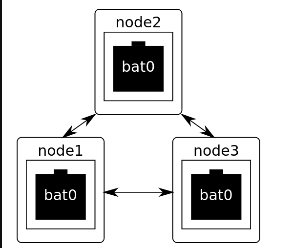

# Configuration d'un noeud 
[Tuto](https://github.com/binnes/WiFiMeshRaspberryPi/blob/master/part1/PIMESH.md#setup-batman-adv)

## Batman-adv
[Batman-adc wiki](https://www.open-mesh.org/projects/open-mesh/wiki)

Une telle instance est une interface réseau virtuelle (souvent appelée "bat0") qui apparaît au système comme un port de commutateur permettant l'accès au commutateur distribué. Les détails réels de la communication (directe ou indirecte) entre les nœuds sont ensuite masqués derrière l'interface réseau "bat0".



Nous allons configurer le module noyau batman-adv pour prendre le contrôle de l'interface WiFi wlan0 et créer un réseau maillé sur WiFi. Batman-adv créera ensuite une nouvelle interface bat0 pour permettre au Pi d'envoyer du trafic réseau sur le réseau 

## Mise en place du noeud

Pour gérer le réseau maillé, il est nécessaire d'installer un utilitaire appelé batctl. Cela peut être fait à l'aide de la commande :
```bash
sudo apt-get install -y batctl
```
Editez le fichier ~/start-batman-adv.sh.
```bash
nano ~/start-batman-adv.sh
```
Avec les lignes suivantes : 
```
#!/bin/bash
# batman-adv interface to use
sudo batctl if add wlan0
sudo ifconfig bat0 mtu 1468

# Tell batman-adv this is a gateway client
sudo batctl gw_mode client 

# Activates batman-adv interfaces
sudo ifconfig wlan0 up
sudo ifconfig bat0 up
sudo iwconfig wlan0 mode ad-hoc
sudo iwconfig wlan0 channel 1
sudo iwconfig wlan0 call-code-mesh

sudo dhclient wlan0 
```

Rendez le fichier start-batman-adv.sh exécutable à l'aide de la commande :
```bash
chmod +x ~/start-batman-adv.sh
```

Assurez-vous que le module du noyau batman-adv est chargé au démarrage en utilisant la commande suivante :
```bash
echo 'batman-adv' | sudo tee --append /etc/modules
```

Arrêtez le processus DHCP qui tente de gérer l'interface sans fil en utilisant la commande suivante :
```bash
echo 'denyinterfaces wlan0' | sudo tee --append /etc/dhcpcd.conf
```

Assurez-vous que le script de démarrage est appelé en éditant le fichier /etc/rc.local en tant qu'utilisateur root, par exemple :
```bash
sudo nano /etc/rc.local
```
et insérez : 

    /home/pi/start-batman-adv.sh &

Derriere la derniere ligne: exit 0