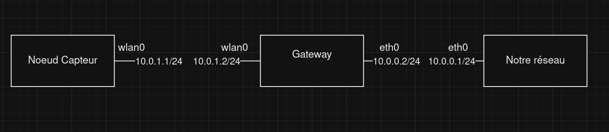

# Mode de connection temporaire

Pour commencer à tester la remonté de donnée on utilise des protocoles simple. 
## Adressage 


## SFTP 
Mise en place du serveur sftp

```bash
groupadd sftp

mkdir /sftp

chmod 755 /sftp

nano /etc/ssh/sshd_config
```

Contenue de la fin du fichier sshd_config :
```
#override default of no subsystems
Subsystem sftp internal-sftp
 
#Example of overriding settings on a per-user basis
Match Group sftp
X11Forwarding no
AllowTcpForwarding no
PermitTunnel no
ForceCommand internal-sftp -d /upload
ChrootDirectory /sftp/%u
```

```bash
useradd -s /usr/bin/false -d /sftp/test -G sftp test

passwd test

chown root:sftp /sftp/test
chmod 750 /sftp/test

mkdir /sftp/test/upload
chown test:test /sftp/test/upload
chmod 750 /sftp/test/upload
```

- Tester la connection
```bash
sftp test@IP_serveur
```
